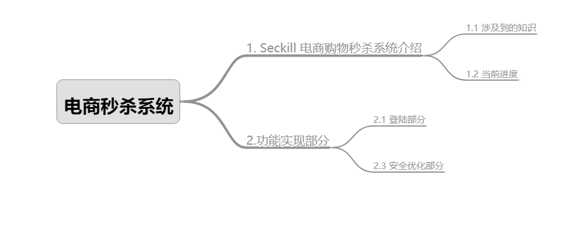

---
title: 电商秒杀系统
tags: 电商，秒杀系统,MARKDOWN,帮助
slug: storywriter/grammar
grammar_abbr: true
grammar_table: true
grammar_defList: true
grammar_emoji: true
grammar_footnote: true
grammar_ins: true
grammar_mark: true
grammar_sub: true
grammar_sup: true
grammar_checkbox: true
grammar_mathjax: true
grammar_flow: true
grammar_sequence: true
grammar_plot: true
grammar_code: true
grammar_highlight: true
grammar_html: true
grammar_linkify: true
grammar_typographer: true
grammar_video: true
grammar_audio: true
grammar_attachment: true
grammar_mermaid: true
grammar_classy: true
grammar_cjkEmphasis: true
grammar_cjkRuby: true
grammar_center: true
grammar_align: true
grammar_tableExtra: true
--- 

[toc!?theme=gray&depth=4]


# 1. Seckill 电商购物秒杀系统介绍

## 1.1 涉及到的知识
- VUE全家桶(前端开发)
- SpringBoot、Spring、SpringMVC、Mybatis 后台开发
- MySQL、Redis

## 1.2 当前进度
- 功能：登录页、登陆功能

# 2.功能实现部分
## 2.1 登陆部分
- 两次MD5
```markdown
 1. 用户端： PASS = MD5( 明文 + 固定 Salt) 

 2. 服务端： PASS = MD5( 用户输入 + 随机 Salt)

	通过两次MD5，可以增大http明文传输过程或数据库被盗后，黑客通过彩虹表等手段反推出明文密码的难度（有一定作用，但不能保证绝对安全）。
```
添加的依赖如下：
```markdown?linenums
        <dependency>
            <groupId>commons-codec</groupId>
            <artifactId>commons-codec</artifactId>
        </dependency>

        <dependency>
            <groupId>org.apache.commons</groupId>
            <artifactId>commons-lang3</artifactId>
            <version>3.6</version>
        </dependency>

        <dependency>
            <groupId>commons-collections</groupId>
            <artifactId>commons-collections</artifactId>
            <version>3.2.1</version>
        </dependency>
```

- 手机号码校验部分
 ```markdown
1. JSR303参数校验 + 全局异常处理器

2. service中的方法入参有许多参数的判断代码，为了简化，可以利用JSR303参数校验

3. pom文件引入依赖
 ```
 
 ```markdown?linenums
 		<dependency>
			<groupId>org.springframework.boot</groupId>
			<artifactId>spring-boot-starter-validation</artifactId>
		</dependency>
 ```


## 2.3 安全优化部分
- 隐藏秒杀地址
```markdown
思路：秒杀开始前，先去请求接口获取秒杀地址

1.接口改造，带上PathVariable参数

2.添加生成地址的接口

3.秒杀收到请求，先验证PathVariable
```

 - 数学公式验证码
```markdown
1.添加生产验证码接口

2.在获取秒杀路径的时候，验证验证码

3.ScriptEngine使用
```